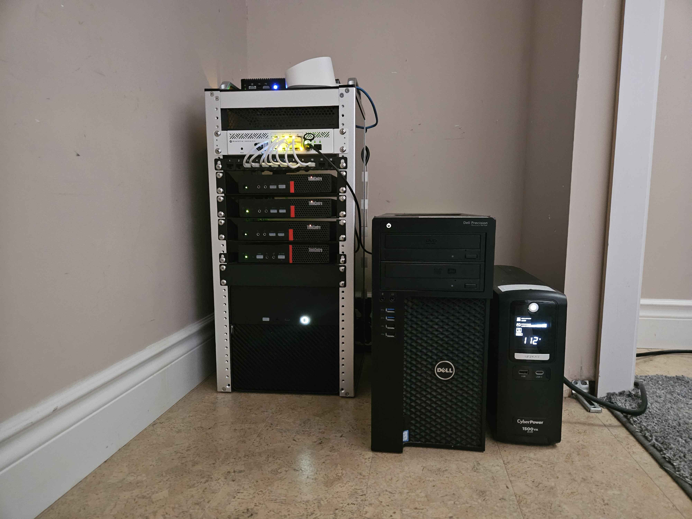
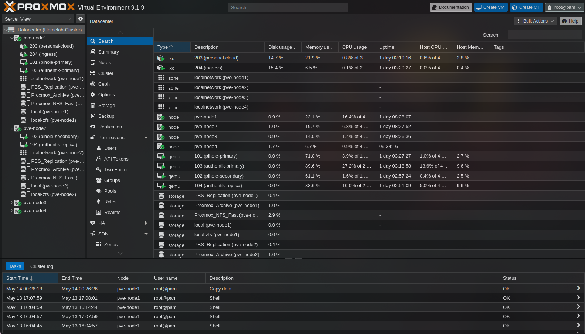

# homelab

<div align="center">


<br>

<br>
<br>
<br>

> Personal documentation for a self-hosted homelab: a 4-node Proxmox VE cluster with TrueNAS Scale storage, pfSense routing, and Podman Quadlet-based containerization. Built with an IaC-first approach (Packer, Terraform, cloud-init, Ansible) and designed around proper network segmentation, high availability where it matters, and a complete 3-2-1-1 backup strategy.

</div>

---

## Gallery

> Photos of the physical lab, rack, and dashboards live in [`/img/`](./img/).

### Rack

[](./img/rack/front-rack.jpg)

### Proxmox Cluster

[](./img/dashboards/proxmox.png)

<!-- Add later when available -->
<!--
### Grafana Dashboard

[](./img/dashboards/grafana-overview.png)
-->

---

## Contents

- [Hardware](#hardware)
- [Software Stack](#software-stack)
- [Network Topology](#network-topology)
- [Core Architecture](#core-architecture)
- [Storage](#storage)
- [Resources](#resources)

---

## Hardware

| Node      | CPU                                  | RAM        | Network           | Role |
|------------|--------------------------------------|------------|-------------------|------|
| pve-node1 | i5-7400T (ThinkCentre)              | 32&nbsp;GB | 2.5&nbsp;GbE      | General workloads |
| pve-node2 | i5-7500T (ThinkCentre)              | 32&nbsp;GB | 2.5&nbsp;GbE      | General workloads |
| pve-node3 | i5-7500T (ThinkCentre)              | 16&nbsp;GB | 2.5&nbsp;GbE      | General workloads |
| pve-node4 | i7-7700 (Dell Tower)                | 32&nbsp;GB | 10&nbsp;GbE SFP+  | Performance node: GPU, CTF labs, Windows |
| pbs-node  | AMD PRO A10-9700E (4C+6G, 10 cores) | 16&nbsp;GB | 2.5&nbsp;GbE      | Standalone PBS, 2 TB datastore |
| truenas   | Intel N5105 (Jonsbo N2 NAS)         | 16&nbsp;GB | 2.5&nbsp;GbE + 10&nbsp;GbE | 5x1 TB RAIDZ1 HDD, 2x1 TB NVMe cache |
| pi-jump   | Raspberry Pi 5                      | —          | GbE               | QDevice + UPS master + kiosk display |

---

## Software Stack

| Layer | Technology |
|-------|------------|
| Hypervisor | Proxmox VE (KVM/QEMU + LXC) |
| Backup | Proxmox Backup Server (physical standalone node) |
| Storage | TrueNAS Scale, ZFS (FastPool NVMe + AppPool NVMe + Tank HDD) |
| Networking | pfSense edge, MikroTik CRS310, 6 VLANs |
| Containers | Podman + Podman Quadlets (systemd-native, rootful for NFS bind mounts) |
| IaC | Packer, Terraform, cloud-init, Ansible |
| Remote access | Tailscale mesh VPN (Headscale planned) |
| DNS | Pi-hole 6 + Unbound (recursive resolver), split-horizon |
| Reverse proxy | Nginx Proxy Manager (internal), HAProxy on pfSense (public) |
| SSO | Authentik |
| Observability | Prometheus, Grafana, Loki, Uptime Kuma |
| Base OS | Debian 13 (VMs/LXC), Raspberry Pi OS (Pi) |
| Git + CI | Forgejo + Forgejo Runner |

---

## Network Topology

> RoutOS dashboard reference image in [`/img/dashboards/routeros`](./img/dashboards/routeros.png).

```
ISP
 └── Eero (NAT, port forwards: 443, 25565, 9001)
      └── pfSense (igc1 = WAN)
           └── igc0 -> MikroTik CRS310 (trunk, all VLANs tagged)
                ├── ether1  -> pve-node1   (trunk: 10,20,30,40,50,666)
                ├── ether2  -> pve-node2   (trunk: 10,20,30,40,50,666)
                ├── ether3  -> pve-node3   (trunk: 10,20,30,40,50,666)
                ├── ether4  -> pbs-node    (trunk: 10,20)
                ├── ether5  -> truenas     (trunk: 10,20)
                ├── ether6  -> pfSense     (uplink, all VLANs)
                ├── ether7  -> pi-jump     (access, untagged VLAN 10)
                ├── ether8  -> Netgear AP  (trunk: 10,40,50)
                └── sfp+1   -> pve-node4   (trunk: 10,20,30,40,50,666, 10 GbE)
```

### VLAN Design

| VLAN | ID | Subnet | Gateway | Purpose |
|------|----|--------|---------|---------|
| Management | 10 | 10.0.10.0/24 | 10.0.10.1 | Proxmox nodes, TrueNAS, switch, PBS. Tailscale-gated |
| Storage | 20 | 10.0.20.0/24 | 10.0.20.1 | NFS/SMB traffic. L2 only, no inter-VLAN routing |
| Services | 30 | 10.0.30.0/24 | 10.0.30.1 | VMs, LXC containers, internal services |
| Trusted | 40 | 10.0.40.0/24 | 10.0.40.1 | Personal devices, homelab Wi-Fi |
| IoT | 50 | 10.0.50.0/24 | 10.0.50.1 | Smart devices, guest Wi-Fi, CTF lab VMs |
| DMZ | 666 | 10.0.66.0/24 | 10.0.66.1 | Public-facing services, blocked from all internal VLANs |

**VLAN philosophy:**

VLAN 20 (Storage) is a dedicated data plane. pfSense blocks all routing into or out of it. NFS traffic stays L2 between Proxmox nodes, PBS, and TrueNAS.

VLAN 10 (Management) is Tailscale-gated. No direct access without being on the mesh VPN.

VLAN 666 (DMZ) has a hard block rule against all RFC1918 space. Public internet outbound only.

Pi-hole at `10.0.30.9` and `10.0.30.11` serves DNS for Management, Services, Trusted, and IoT. DMZ uses pfSense directly with no internal DNS visibility.

> Example firewall configuration reference image in [`/img/dashboards/pfsense`](./img/dashboards/pfsense.png).


### IP Allocation

**Management VLAN 10 (10.0.10.0/24)**

| Device | IP | Hostname |
|--------|----|----------|
| pfSense | 10.0.10.1 | fw.homelab.local |
| MikroTik | 10.0.10.2 | switch.homelab.local |
| pve-node1 | 10.0.10.11 | pve-node1.homelab.local |
| pve-node2 | 10.0.10.12 | pve-node2.homelab.local |
| pve-node3 | 10.0.10.13 | pve-node3.homelab.local |
| pve-node4 | 10.0.10.14 | pve-node4.homelab.local |
| pbs-node | 10.0.10.20 | pbs.homelab.local |
| truenas | 10.0.10.25 | truenas.homelab.local |
| pi-jump | 10.0.10.30 | pi-jump.homelab.local |
| Netgear AP | 10.0.10.40 | ap.homelab.local |

---

## Core Architecture

### IaC Pipeline

```
Forgejo (Git, source of truth)
|
|-- 1. Packer     -> Golden LXC/VM templates (Debian 13)
|                    Bakes in: qemu-agent, node-exporter, SSH keys, sysctl
|
|-- 2. Terraform  -> Clones templates, creates LXC containers and VMs
|                    Sets: CPU, RAM, disk, VLAN tag, IP, hostname
|
|-- 3. cloud-init -> First-boot config injected by Terraform
|                    Sets: users, SSH keys, hostname, network
|
+-- 4. Ansible    -> Day-2 configuration, runs after cloud-init
                     Deploys: Podman Quadlet unit files to /etc/containers/systemd/
                     Manages: systemd services, bind mounts, firewall rules

Flow: git push -> Forgejo webhook -> CI runner -> terraform apply -> ansible-playbook
```

### Service Delivery: Podman Quadlets

Every container is a systemd unit. Ansible drops `.container` files into `/etc/containers/systemd/` and runs `systemctl daemon-reload`. Services are managed like any other systemd unit:

```bash
systemctl start jellyfin
systemctl status jellyfin
journalctl -u jellyfin
```

### VM/LXC Tiering

| ID Range | Tier | Type | Description |
|----------|------|------|-------------|
| 101-199 | 1 | VM | HA-critical infrastructure (Proxmox HA group: critical) |
| 201-299 | 2 | LXC | Service workloads, Podman Quadlets (HA group: services) |
| 301-399 | 3 | VM | DMZ, public-facing, no HA, air-gapped |
| 401-499 | 4 | VM | Isolated lab, pinned to node4, local NVMe, no migration |
| 501-599 | 5 | LXC | System daemons, kernel/host-level access only |
| 601-699 | 6 | VM | Future Kubernetes cluster (VLAN 50, isolated) |

---

## Storage

### TrueNAS Pools

> Dataset reference image in [`/img/dashboards/truenas`](./img/dashboards/truenas.png).

```
TrueNAS (10.0.20.25, Storage VLAN 20)
|
|-- FastPool (NVMe A, 1 TB)
|   +-- Proxmox_NFS_Fast      All LXC and VM OS disks. Enables live/cold migration.
|
|-- AppPool (NVMe B, 1 TB)    App data on NVMe, separated from spinning HDD.
|   +-- App_Data/
|       |-- VM_Auth/           Authentik postgres, high random R/W
|       |-- VM_Auth_Rep/       Authentik postgres replica
|       |-- VM_Net/            Pi-hole data
|       |-- LXC_Cloud/         Immich postgres + ML cache + thumbnails
|       |-- LXC_Obs/           Prometheus TSDB, write-heavy
|       |-- LXC_Arr/           Radarr, Sonarr, qBit config DBs
|       |-- LXC_Media/         Jellyfin metadata
|       +-- LXC_Ingress/       NPM proxy config
|
+-- Tank (HDD, spinning)
    |-- Media/
    |   |-- Immich_Library/    Original photos and videos, NFS to lxc-203
    |   |-- Jellyfin_Library/  Movies and TV, re-downloadable
    |   +-- Proxmox_Archive/   Cold ISOs, OVA templates
    |-- Shares/
    |   |-- Personal_Vault/    SMB + NFS, personal documents, encrypted
    |   +-- Trusted_Share/     SMB, shared documents
    +-- Backups/
        |-- PBS_Replication/   NFS, PBS datastore managed by pbs-node
        +-- Config_Backups/    SMB, pfSense XML, TrueNAS config, SSH keys
```

---

## Resources

- [r/homelab](https://reddit.com/r/homelab) - Community for homelab enthusiasts
- [r/minilab](https://reddit.com/r/minilab) - Inspiration for compact homelab builds
